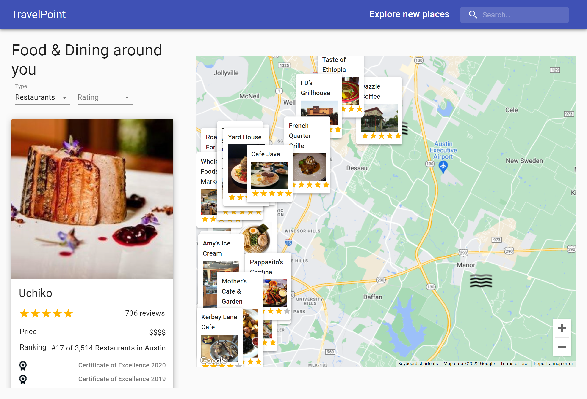

# Travel Point

## Description

The purpose of this application is to provide the User with points of interests(restaurants, hotels, etc.) at the desired location. For interactivity, the app provides a search box with autocomplete functionality, filter POI by type and ratings, links to homepage of POI and Travel Advisor website for reviews. The app also adds current weather icons on the Google map for better planning of the day.

## Table of Contents

- [Installation](#installation)
- [Usage](#usage)
- [Technologies](#technologies)
- [Contact](#contact)



`Live:` https://travelpoint.netlify.app/

## Installation

No installation needed, please follow the link for live app.

## Usage

At the first visit the app will use the browser location to load the area. The autocomplete search will help the User to find the desired location. By clicking any results from the map, the location will be selected and scrolled onto on the search result located on the left side. There the User will find information about the place, contact information, homepage and link to travel advisor for reviews.

## Technologies

- React
- Axios
- Material-UI
- Google Maps Api
- OpenWeather Api

## Development

```
This project was bootstrapped with [Create React App](https://github.com/facebook/create-react-app).

## Available Scripts

In the project directory, you can run:

### `npm start`

Runs the app in the development mode.\
Open [http://localhost:3000](http://localhost:3000) to view it in your browser.

The page will reload when you make changes.\
You may also see any lint errors in the console.

### `npm test`

Launches the test runner in the interactive watch mode.\
See the section about [running tests](https://facebook.github.io/create-react-app/docs/running-tests) for more information.

### `npm run build`

Builds the app for production to the `build` folder.\
It correctly bundles React in production mode and optimizes the build for the best performance.

The build is minified and the filenames include the hashes.\
Your app is ready to be deployed!

See the section about [deployment](https://facebook.github.io/create-react-app/docs/deployment) for more information.

### `npm run eject`

**Note: this is a one-way operation. Once you `eject`, you can't go back!**

If you aren't satisfied with the build tool and configuration choices, you can `eject` at any time. This command will remove the single build dependency from your project.

Instead, it will copy all the configuration files and the transitive dependencies (webpack, Babel, ESLint, etc) right into your project so you have full control over them. All of the commands except `eject` will still work, but they will point to the copied scripts so you can tweak them. At this point you're on your own.

You don't have to ever use `eject`. The curated feature set is suitable for small and middle deployments, and you shouldn't feel obligated to use this feature. However we understand that this tool wouldn't be useful if you couldn't customize it when you are ready for it.

```

## Contact

- GitHub: https://github.com/vitokwolf
- Email: victor.lupascu.1985@gmail.com
